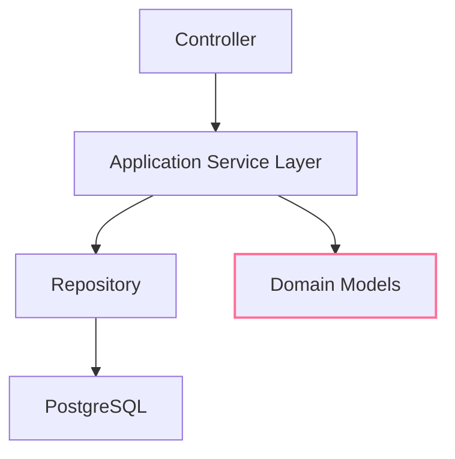

# 🍴 Sufrá - Modern Restaurant Management Platform


Sufrá is a comprehensive restaurant reservation and food ordering system designed with scalability and domain-driven principles in mind. The platform serves three distinct user roles with robust features, implemented using modern architectural patterns and performance-optimized database operations.

---

## 🌟 Key Highlights

- **Production-Grade Architecture**
  - Layered design with clear separation of concerns, evolving toward Domain-Driven Design (DDD)
  - Utilized aggregates and root aggregates to build rich domain models in key entities

- **Performance Optimizations**
  - Trigram-based fuzzy search using PostgreSQL similarity (`pg_trgm` extension)
  - N+1 query prevention with strategic eager/lazy loading
  - Pagination and filtering across all listings for scalable performance

- **Email Integration**
  - Automated email notifications for confirmations and rejections
  - QR code generation for reservation confirmation

- **Advanced Reservation Logic**
  - Smart table allocation with "max effort" capacity management
  - Fallback strategies for handling edge cases and overbookings

---

## 👥 User Role Matrix

### 👑 Admin Capabilities

- Secure authentication and access control
- Full CRUD operations on restaurants, including approval and blocking
- Advanced search with trigram-based fuzzy matching combined with multi-criteria filtering and paginated results
- System-wide oversight of all reservations and orders with pagination and dynamic filtering

### 🕴️ Restaurant Manager Features

- Register your restaurant and login to your dashboard
- Full CRUD for tables with labels and seating capacities
- Define and update operating hours
- Manage menu sections and menu items (CRUD)
- Update order status through full lifecycle: Pending → Preparing → Ready → Delivered/Canceled
- Approve or reject reservations with automated email notifications and QR code confirmations

### 👥 Customer Experience

- Secure registration and login
- Discover approved restaurants with fuzzy search, filtering, and pagination
- Browse restaurant menus organized by sections
- Book tables with a smart reservation system and fallback handling
- Cancel reservations when needed
- Manage cart, place orders, cancel if unprepared, and track order status
- Receive email confirmations with QR codes for reservations

---

## 🛠️ Technical Deep Dive

### Backend Stack

- **Framework:** .NET 9
- **Database:** PostgreSQL (with `pg_trgm` extension)
- **Authentication:** JWT with BCrypt password hashing
- **Email:** SMTP integration with templated messages

### Frontend Stack

- **Framework:** React
- **Styling:** Tailwind CSS

### UI Design

- Prototyped in Figma with complete UI designs  
  [View Figma Designs](https://www.figma.com/design/KEogmNOd6C18xBlSZhmzUI/Sufr%C3%A1?node-id=0-1&t=FbwQ7tHBZPepIqb3-1)

---

## 🏗 Architecture Pattern



---

## 🚀 Getting Started

### 📦 Prerequisites

- [.NET 9 SDK](https://dotnet.microsoft.com/en-us/download/dotnet/9.0)
- [PostgreSQL 15+](https://www.postgresql.org/download/)
- [EF Core CLI](https://docs.microsoft.com/en-us/ef/core/cli/)

### 🐳 Using Docker for PostgreSQL (Recommended)

For development, you can run PostgreSQL in a Docker container for consistency and easy setup:

```bash
docker run --name sufra-postgres \
  -e POSTGRES_USER=postgres \
  -e POSTGRES_PASSWORD=password \
  -e POSTGRES_DB=sufra_v2 \
  -p 5432:5432 \
  -d postgres:latest
```

### 🚩 Important Security Notice

- The appsettings.json included in this repository is intended for development only. If you modify it:
    - Update your .gitignore to prevent committing sensitive data
    - Never commit production credentials or secrets to version control

## Installation & Run

```
### Clone the repository
git clone https://github.com/IbrahimElFitiany/SufraAPI
cd SufraAPI

### Restore dependencies
dotnet restore

### Apply database migrations
dotnet ef database update

### Run the backend server
dotnet run
```
## 📬 API Postman Collection

- Import the Postman collection to explore and test all available API endpoints:  
  [Download Postman Collection](./Sufra.postman_collection.json)

## 🌐 Frontend Repository

- The frontend is maintained separately and still under active development:

- 👉 [Sufrá Frontend Repository](https://github.com/IbrahimElFitiany/Sufra_FrontEnd)
